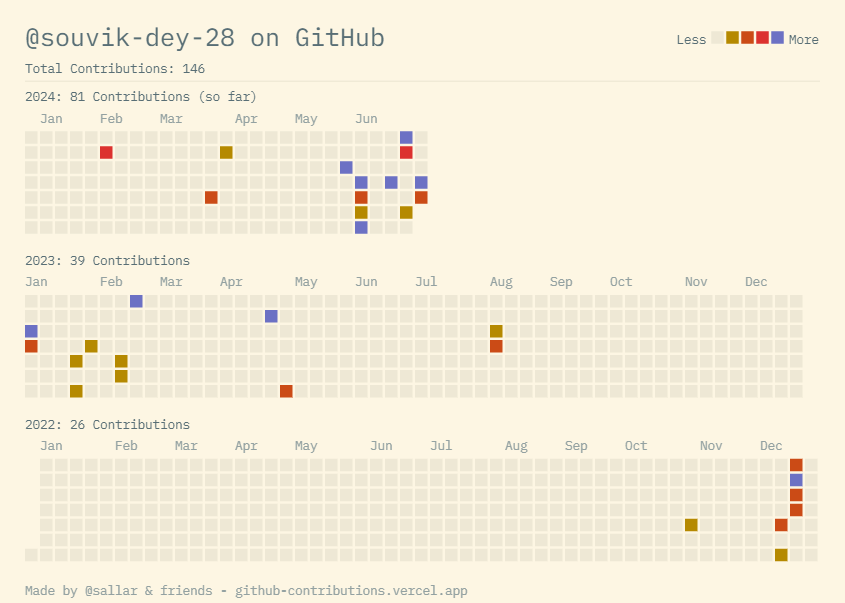

### Hi there 👋

<!--
**souvik-dey-28/souvik-dey-28** is a ✨ _special_ ✨ repository because its `README.md` (this file) appears on your GitHub profile.

Here are some ideas to get you started:

- 🔭 I’m currently working on ...
- 🌱 I’m currently learning ...
- 👯 I’m looking to collaborate on ...
- 🤔 I’m looking for help with ...
- 💬 Ask me about ...
- 📫 How to reach me: ...
- 😄 Pronouns: ...
- ⚡ Fun fact: ...
-->
<h1 align="center">Hi 👋, I'm SOUVIK DEY</h1>
<h3 align="center">A passionate frontend developer from India.</h3>

  

  

  

- 🔭 I’m currently working on [ECOMMERCE WEBSITE](https://souvik-dey-28.github.io/ecommerce-website/)

- 🌱 I’m currently learning **FONTEND AND BACKEND**

- 👯 I’m looking to collaborate on [ONLINE BUS TICKET BOOKING](https://souvik-dey-28.github.io/online-bus-ticket-booking2/)

- 🤝 I’m looking for help with [weather information](https://souvik-dey-28.github.io/weather-details/)

- 👨‍💻 All of my projects are available at GITHUB [https://souvik-dey-28.github.io/personal-portfolio-souvikdey/](https://souvik-dey-28.github.io/personal-portfolio-souvikdey/)

- 📝 I regularly write articles on [https://souvik-dey-28.github.io/profile-card/](https://souvik-dey-28.github.io/profile-card/)

- 💬 Ask me about **HTML, CSS, JS, C, C++, KOTLIN, PYTHON,**

- 📫 How to reach me **deysouvik023@gmail.com**

- 📄 Know about my experiences [https://drive.google.com/file/d/131resJOtvLxYUVoRXNB5C7qew9cM6-Bq/view?usp=drivesdk](https://drive.google.com/file/d/131resJOtvLxYUVoRXNB5C7qew9cM6-Bq/view?usp=drivesdk)

- ⚡ Fun fact **I fear dogs🐶, and I love cats😺😻, I THINK I AM INTELIGENT BUT LITTLE BIT LAZY😅😅😁👍😉🤞**

<h3 align="left">Connect with me:</h3>

<h3 align="left">Languages and Tools:</h3>

                                                                          

<!-- different -->

## My Skill Set  
<table><tr><td valign="top" width="33%">

### Frontend  

  
  
  
  
  
  
  
  
  
  
  
  
  
  
  
  
  
  
  
  
  
  
  
  
  
  
  
  
  

  

### Android Dev  

  
  
  
  
  
  
  
  
  
  
  
  
  
  
  
  
  
  
  
  
  
  

</td><td valign="top" width="33%">

### Backend  

  
  
  
  
  
  
  
  
  
  
  
  
  
  
  
  
  
  
  
  
  
  
  
  
  
  
  
  
  
  
  
  
  
  

  

### Software Engineer  

  
  
  
  
  
  
  
  
  
  
  
  
  
  
  
  
  
  

</td><td valign="top" width="33%">

### Ethical Hacking  

  
  
  
  
  
  
  
  
  
  
  
  
  
  
  
  
  
  
  

  

### Devops  

  
  
  
  
  
  
  
  
  
  
  
  
  
  
  

</td></tr></table>  

   

&nbsp;

<!--

 

###  -->

<h1 align="left">Hi 👋! My name is Souvik Dey and I'm a Final year B.Tech Student  from India</h1>

###

###

  
  
  
  
  
  
  
  
  
  
  
  
  
  
  
  
  
  
  
  
  
  
  
  
  
  
  
  
  
  
  
  
  
  
  
  
  
  
  
  
  
  
  
  
  
  
  
  
  
  
  
  
  
  
  
  
  
  
  
  
  
  
  
  
  
  
  
  
  
  
  
  
  
  
  
  
  
  
  
  
  
  
  
  
  
  
  
  
  
  
  
  
  
  
  
  
  
  
  
  
  
  
  
  
  
  
  
  
  
  
  
  
  
  
  
  
  
  
  
  
  
  
  
  
  
  
  
  
  
  
  
  
  
  
  
  
  
  
  
  
  
  
  
  
  
  
  
  
  
  
  

###

###

  
  
  
  
  
  
  
  
  
  
  
  

###

<!--

 

###  -->

### Hi there 👋, my name is Souvik Dey
#### I am Web dev
I made this project just for fun, it allows you to creativity

Skills: VUE JS / REACT / JS / HTML / CSS

- 🔭 I’m currently working on this page. 

  

     

<!--
  

  

  
-->

